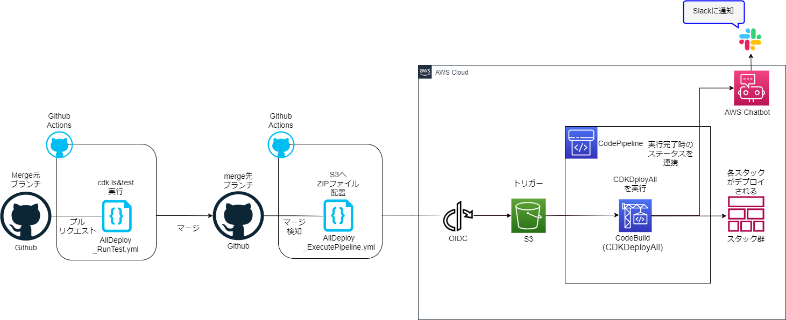

# HowToDeployInfraResourcesPipeline

mynv-pipeline-InfraResources-stack はすべての CDK スタックを Deploy するための Pipeline を構築するためのスタックである。  
mynv-pipeline-InfraResources-stack(以下 InfraResourcesPipeline)について以下に記す。

## InfraResourcesPipeline 構成図

InfraResourcesPipeline の構成図については以下の通り。



- InfraResourcesPipeline は Merge 元ブランチから Merge 先ブランチへのプルリクエストをきっかけにテストが実施される。
- その後、マージを行ったタイミングで、Repository 内のデプロイに必要なファイルを ZIP 化、S3 に配置される。
- S3 に配置されたことを契機に Pipeline が実行される。
- InfraResourcesPipeline は、CodeBuild での InfraResources 完了時に Slack へ通知されるように設定されている。

Pipeline の実行には事前に InfraResourcesPipeline デプロイ実施する必要があるため、後述の手順に従いながら、デプロイを実施すること。

## InfraResourcesPipeline のデプロイの流れ

InfraResourcesPipeline をデプロイし、Pipeline を使用可能な状態にするためには、下記の手順を行う必要がある。

1.  InfraResourcesPipeline 事前準備
1.  InfraResourcesPipeline の初期デプロイ(CodeBuild の実行なし)
1.  InfraResources_ExecutePipeline.yml へのデプロイ関連情報の追加

これらすべてを完了させることにより InfraResourcesPipeline が使用可能な状態となる。

## InfraResourcesPipeline 事前準備

InfraResourcesPipeline の事前準備として下記の二つを完了させること。

1.  Slack への AWS ユーザ追加と Slack 情報取得【GUI】
1.  params ファイルへの Slack 情報の追加【コード編集】

### 1.Slack への AWS ユーザ追加と Slack 情報取得【GUI】

#### Slack への AWS ユーザ追加(プライベートチャンネルの場合必須)

CodeBuild 完了通知の送信先に指定する Slack チャンネルにて、チャット投稿と同じ要領で、下記のコマンドを入力し、AWS ユーザをチャットに招待する。

```
/invite @aws
```

AWS ユーザが追加されたことを確認し、完了。

#### Slack 情報取得

・下記の URL に記載されている方法を使用し、Slack のワークスペース URL を取得。

https://slack.com/intl/ja-jp/help/articles/221769328-%E8%87%AA%E5%88%86%E3%81%8C%E5%8F%82%E5%8A%A0%E3%81%97%E3%81%A6%E3%81%84%E3%82%8B%E3%83%AF%E3%83%BC%E3%82%AF%E3%82%B9%E3%83%9A%E3%83%BC%E3%82%B9%E3%81%AE-Slack-URL-%E3%82%92%E7%A2%BA%E8%AA%8D%E3%81%99%E3%82%8B

- 取得した URL を使用し、Slack の Web 版にアクセスする。

- 左ペインから通知先に指定したいチャンネルをクリック。※この時、チャンネル名もメモしておく。

- URL を確認し、ワークスペース ID とチャンネル ID を取得し、メモする。

```
https://app.slack.com/client/ワークスペースID/チャンネルID
```

### 2.params ファイルへの Slack 情報の追加【コード編集】

先ほど取得した、チャンネル名、ワークスペース ID、チャンネル ID を下記の要領で params ファイルに記載する。

```
export const InfraResourcesPipelineParam: inf.IInfraResourcesPipelineParam = {
  slackChannelName: 'チャンネル名',
  slackWorkspaceId: 'ワークスペースID',
  slackChannelId: 'チャンネルID',
};
```

## InfraResourcesPipeline のデプロイ

InfraResourcesPipeline の初回デプロイを行うため下記を実行する。

```
npx cdk deploy '先頭大文字環境名+PJPrefix'-Pipeline -c environment='先頭小文字環境名'
```

※この時、Pipeline のデプロイは完了するものの、Pipeline の実行は失敗するため、気にせず次の手順を実施すること。

## InfraResources 関連 yml への情報追加

InfraResources 関連 yml ファイルの情報追加方法は下記を参照。
[README.md](../.github/workflows/README.md)

## InfraResourcesPipeline の実行方法

上記すべての手順を完了したのち、Merge 先ブランチへの Merge 処理を実施することにより、InfraResourcesPipeline が起動し、CodeBuild 内にて CDKDeployAll が実行される。

## Pipeline の注意点

1.  Pipeline を再デプロイするだけでは、Pipeline の実行されないため、Pipeline の更新と、deployAll を両方行いたい場合は、Pipeline 再 deploy 後に、Github 側で Merge 処理を行う必要がある。
1.  検証時の CDKDeployAll 初回実行時間は約 1 時間半かかっているため、実際のデプロイ時間も同様かそれ以上の時間を要する可能性が高い。
1.  スタックコードに記載されている、`trigger: actions.S3Trigger.NONE`の`NONE`は EventBridge をトリガーとするために使用している。  
    ※`NONE`を使用せず`EVENT`を使用した場合は、CloudTrail のデータイベントにてトリガー検知する仕様になっている。
