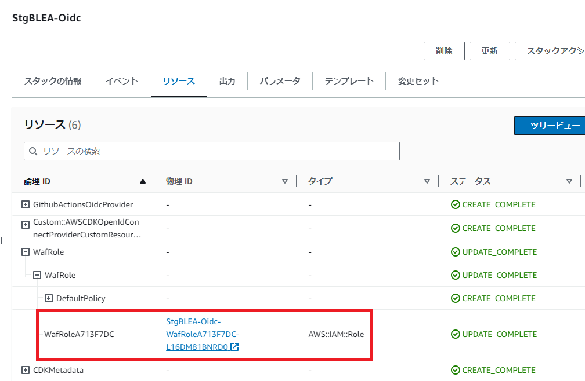
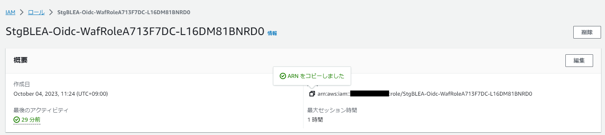

# OIDC(OpenIdConnect)スタックの利用方法について

ここでは、OIDC スタックの利用方法と GitHubActions との連携方法を記載する。

## 概要

- GitHubActions から AWS リソースへアクセスするケースを想定し、その手法として OpenIdConnect を利用する。
- アクセスするリソースは要件によって異なるため、AWS の最小権限に準拠し要件毎にロールを分ける方針とする。
- 下図に GitHubActions から OIDC を利用した AWS リソースへのアクセス例を示す。
  1. GitHubActions を実行する。
     ※実行パターンは手動実行とプルリクエストやマージをトリガーとする自動の２パターンがある。
  1. GitHubActions から任意の IAM ロールへアクセスする。
  1. 引き受けたロールにアタッチされたポリシーの範囲内でリソースへの操作を実行する。
     

## 利用手順

利用手順は以下のとおり。

1. OIDC スタックのデプロイ
1. GitHubAction の Workflow ファイルの実装
1. GitHubAction の 実行

### 1. スタックのデプロイ

1. OIDC スタック内の GitHubActions が利用する IAM ロールを実装する。

   - OIDC スタック内で既に実装されている IAM ロールもあるため、その IAM ロールで問題なければ 「1-1. IAM ロール実装」はスキップ。
   - CDK コード内に IAM ロールと IAM ポリシーのコンストラクトが用意されているため、それを用いて 以下のコードのように IAM ロールを実装する。

   **lib/mynv-oidc-stack.ts**

   ```Typescript
    // WAF用ロール
    new MynvOidcIamRoleConstruct(this, 'WafRole', {
      OrganizationName: props.OrganizationName,
      RepositoryName: props.RepositoryNames.WafRepositoryName,
      openIdConnectProviderArn: oidcProvider.openIdConnectProviderArn,
      statement: [
       {
        actions: ['wafv2:ListWebACLs', 'wafv2:GetWebACL', 'wafv2:UpdateWebACL'],
        resources: ['*'],
       }
      ],
    });
   ```

   - ポリシーを付与する AWS リソースの絞り込みを行う場合には、conditions 句を利用し、以下のコードを参考に IAM ロールを実装する。  
     conditions 句はオプションである。

   **lib/mynv-oidc-stack.ts**

   ```Typescript
   // (例)S3用ロール
   new MynvOidcIamRoleConstruct(this, 'S3Role', {
      (略)
    statement: [
        {
          actions: ['ec2:CreateVolume'],
          resources: ['*'],
        },

        {
          actions: ['s3:GetObject', 's3:GetBucketLocation', 's3:ListBucket'],
          resources: ['arn:aws:s3:::awsexamplebucket1/*'],
          conditions: {
            StringEquals: {
              's3:prefix': ['projects'],
              'aws:PrincipalTag/role': ['audit', 'security'],
            },
            ArnLike: {
              'aws:PrincipalArn': ['arn:aws:iam::222222222222:user/Ana', 'arn:aws:iam::222222222222:user/Mary'],
            },
          },
        },
      ],
   });
   ```

1. パラメータファイル（/params 配下）に GitHub のリポジトリ名を記入する。

   - リポジトリを複数利用する場合には、キーとリポジトリ名を適宜追加する。

   **params/任意の環境ファイル.ts**

   ```Typescript
   export const OidcParam: inf.IOidcParam = {
     OrganizationName: 'OrganizationName',
     RepositoryNames: {
       WafRepositoryName: 'WafRepositoryName',
       InfraRepositoryName: 'InfraRepositoryName'
    　},
   };
   ```

1. OIDC スタックをデプロイし、GitHubActions で利用する IAM ロールの ARN を控える。
   - CloudFormation から OIDC スタックのリソースタブを表示し、利用する IAM ロールを押下する。
     
   - 押下すると IAM サービスの画面に遷移するので ARN を控える。当 ARN は GitHubActions の workflows ファイルを実装する上で利用する。
     

### 2. Workflow ファイルの実装

1. `.github/workflows`配下には既に workflow ファイルが用意されているが、新規で作成が必要な場合は workflows_templete.yml を利用する。  
   ※既存の workflow ファイルについては、`.github/workflows`配下の README を参照
1. workflows_templete.yml を編集して手順１で控えた IAM ロールや AWS リソースに対する操作を記載する。

- 備考
  - workflow ファイルは main ブランチ配下の`.github/workflows`に格納しないと識別されないため、動作検証などを実施したい場合は個別にプライベートリポジトリを作成する必要がある。

### 3. GitHubAction の 実行

- GitHubAction の 実行トリガーは作成した workflow ファイルに依存する。手動で実行する場合や、プルリクエストやマージなどをトリガーに自動で実行されるケースもある。
- 各 workflow ファイルの利用方法は`.github/workflows`配下の各手順書を参照
