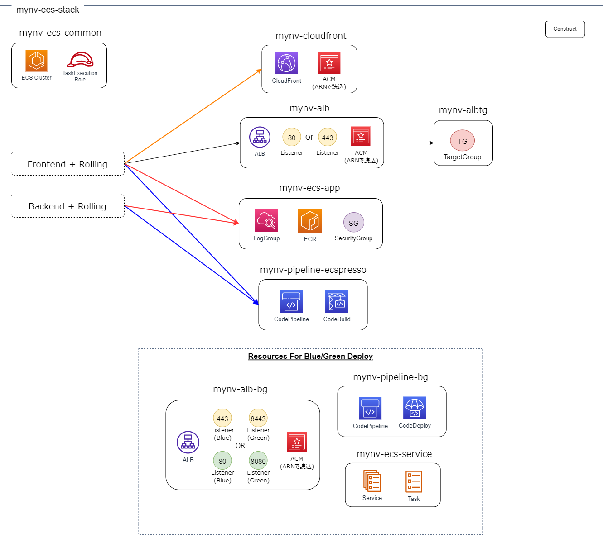
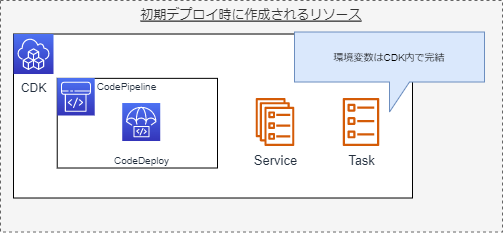
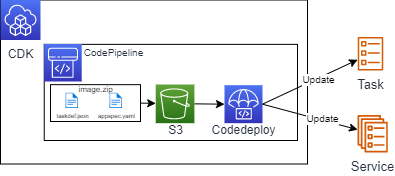
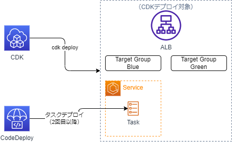

# HowToDeployECS

ここでは、各デプロイパターン毎の利用方法を記載する。

## ECS サービス、タスクのデプロイについて

- デプロイパターンとして、以下の２パターン用意する。
  - [ecspresso](https://github.com/kayac/ecspresso)を使用したローリングデプロイ
  - CodeDeploy を使用した Blue/Green デプロイ
- デプロイパターン 2 種類 × パブリック（Frontend）/プライベート（Backend）2 種類で以下 4 パターンのサンプルをテンプレートとして用意している。


- ECS 関連のリソースは`mynv-ecs-stack.ts`に一式まとめられており、共通リソースと各デプロイに必要なリソースはコンストラクタ単位で管理されている。
  
- ローリングデプロイ利用時の使用リソースは以下のとおり。

  

- Blue/Green 利用時の使用リソースは以下のとおり。

  

- ローリングデプロイと Blue/Green デプロイでは ECS サービスと ECS タスクの管理方法が異なる。
- **ローリングデプロイの ECS サービス/タスク管理方法**

  - ローリングデプロイは ecspresso を利用して ECS サービスと ECS タスクを作成するため、CDK 初回デプロイ時には生成されない。
  - CodePipeline を通して、ecspresso コマンドを実行し、ECS サービス/タスクを作成・更新する。

    

  - 環境変数は CodeBuild 内で設定され、ECS サービス/タスクの json ファイルに直接、埋め込むことが可能
  - [公式ドキュメント](https://github.com/kayac/ecspresso#configuration-file)にも記載のとおり、`` {{ must_env `FOO` }} ``という形で環境変数を動的に渡すことが可能。`must_env`と記載すると、`FOO`が存在しない場合、処理は強制的に終了する。

    

  - ※`` {{ env `FOO` `bar` }} ``と記載すると、`FOO`が定義されていない場合、`bar`に置き換わる。
  - 詳細な利用方法は[公式ドキュメントを参照](https://github.com/kayac/ecspresso#ecspresso)

- **Blue/Green デプロイの ECS サービス/タスク管理方法**

  - Blue/Green デプロイについては CDK 側で ECS サービスと ECS タスクを作成する。
  - CodeDeploy の DeploymentGroup 上で ECS サービス/タスクを指定する必要があるため、初回デプロイ時は CDK で ECS サービス/タスクを作成する。

    

  - 環境変数は CDK 内の props で受け渡しが可能

    

  - 初回以降は CodePipeline を利用して、ECS タスクは`taskdef.json`、ECS サービスは`appspec.yaml`から更新する。

    

## ファイル構成

ECS 関連のファイル構成は以下のとおり

```
.
├── bin
│   └── blea-guest-ecsapp-sample.ts
├── container
│   ├── sample-frontend
│   │   │── app.py
│   │   │── docker-compose.yaml
│   │   │── Dockerfile
│   │   │── index.html
│   │   │── nginx.conf
│   │   ├── build_bg
│   │   │   │── build.sh
│   │   │   │── dev.conf
│   │   │   │── prd.conf
│   │   │   │── stg.conf
│   │   │   │── appspec.yaml
│   │   │   │── imageDetail.json
│   │   │   └── taskdef_template.json
│   │   └── build_ecspresso
│   │       │── build.sh
│   │       │── dev.conf
│   │       │── prd.conf
│   │       │── stg.conf
│   │       │── autoscale.sh
│   │       │── ecs-service-def.json
│   │       │── ecs-task-def.json
│   │       │── ecspresso.yml
│   │       └── imagedefinitions.json
│   └── sample-backend
│       │── app.py
│       │── Dockerfile
│       │── requirements.txt
│       ├── build_bg
│       │   │── build.sh
│       │   │── dev.conf
│       │   │── prd.conf
│       │   │── stg.conf
│       │   │── appspec.yaml
│       │   │── imageDetail.json
│       │   └── taskdef_template.json
│       └── build_ecspresso
│           │── build.sh
│           │── dev.conf
│           │── prd.conf
│           │── stg.conf
│           │── autoscale.sh
│           │── ecs-service-def.json
│           │── ecs-task-def.json
│           │── ecspresso.yml
│           └── imagedefinitions.json
└── lib
    │── mynv-ecs-stack.ts
    │── mynv-ecs-common-construct.ts
    │── mynv-ecs-service-construct.ts
    │── mynv-albtg-construct.ts
    │── mynv-alb-construct.ts
    │── mynv-alb-bg-construct.ts
    │── mynv-cloudfront-construct.ts
    │── mynv-ecsapp-construct.ts
    │── mynv-pipeline-bg-construct.ts
    └── mynv-pipeline-ecspresso-construct.ts
```

### ecspresso を使用したローリングデプロイパターン

#### [ecspresso(Rolling)]作成リソース

- `mynv-ecs-stack.ts`

  - mynv-ecs-common-construct.ts
  - mynv-cloudfront-construct.ts
  - mynv-alb-construct.ts
  - mynv-ecsapp-construct.ts
  - mynv-pipeline-ecspresso-construct.ts

- `mynv-ecs-common-construct.ts`

  - タスク実行ロール
  - ECS クラスター
  - ECS イベント監視

- `mynv-cloudfront-construct.ts`
  - CloudFront（1 個）
- `mynv-alb-construct.ts`
  - ALB（1 個）
  - Target Group（パラメータで指定された分の数を作成）⇒ リソースは`mynv-albtg-construct.ts`で定義し、コンストラクトを呼び出し
- `mynv-ecsapp-construct.ts`の作成リソース

  - ECS サービス用の ECR リポジトリ
  - Security Group
  - CloudWatch Logs
  - ECS サービスの監視設定

- `mynv-pipeline-ecspresso-construct.ts`
  - ECS サービス、ECS タスクデプロイ用の CodePipeline
  - デプロイ用 CodeBuild プロジェクト
  - ソース S3 バケット

#### [ecspresso(Rolling)]パラメータの指定方法

- パラメータは params フォルダ配下の環境名ファイルで以下のとおり指定し、リストに指定した数だけ ECS サービス用の TG や ECR リポジトリといったリソースが作成される。
- Front に関しては、デフォルトルールを 1 つ設定する必要あり（1 つ以外の指定の場合はエラー）。デフォルトルール以外のタスクはリクエストを転送する path を指定する。
- Back に関してはアプリ名とポート名のみ指定すれば良い。

```typescript
export const EcsFrontTasks: inf.IEcsAlbParam[] = [
  {
    appName: 'EcsApp',
    portNumber: 80,
    default: true,
  },
  {
    appName: 'EcsApp2',
    portNumber: 80,
    default: false,
    path: '/path',
  },
];
```

```typescript
export const EcsBackTasks: inf.IEcsInternalParam[] = [
  {
    appName: 'EcsBackend',
    portNumber: 8080,
  },
  {
    appName: 'EcsBackend2',
    portNumber: 8080,
  },
];
```

#### [ecspresso(Rolling)]デプロイ方法

- デプロイ(ECS サービスの更新、ECS タスクの更新)は CodeBuild 上で ecspresso コマンドによって実行される
- S3 バケットに ecspresso 用設定ファイルを zip で格納すると、パイプラインが稼働する。ECS サービスが存在しない場合は新規作成される
- 実際のビルド（docker build および S3 へのイメージ格納）は GitHub Actions 上で実行する想定だが、本リポジトリではサンプルとして`build.sh`を container フォルダ配下に用意しており、各環境ファイルの`APP_NAME`と`PJ_PREFIX`を設定すると動的に`build.sh`内で`AWS_ACCOUNT_ID`、`S3_BUCKET`、`IMAGE_REPO_NAME`が取得されパイプラインが稼働する。
- ローカル上でサンプルコンテナの稼働確認をする場合は、`sample-frontend`フォルダにある`docker-compose.yaml`を使用してコンテナを起動できる。

- 初回および 2 回目以降のデプロイ方法以下のようになる。ecspresso の場合は初回も 2 回目以降も同様の管理方法となる。

| 管理対象リソース | 初回デプロイ         | 2 回目以降のデプロイ |
| ---------------- | -------------------- | -------------------- |
| ALB,TargetGroup  | CDK                  | CDK                  |
| ECS サービス     | ecspresso(CodeBuild) | ecspresso(CodeBuild) |
| AutoScale        | AWS CLI(CodeBuild)   | AWS CLI(CodeBuild)   |
| ECS タスク定義   | ecspresso(CodeBuild) | ecspresso(CodeBuild) |

### CodeDeploy を使用した Blue/Green デプロイパターン

#### [Blue/Green]作成リソース

- `mynv-ecs-stack.ts`

  - mynv-ecs-common-construct.ts
  - mynv-cloudfront-construct.ts
  - mynv-alb-bg-construct.ts
  - mynv-ecsapp-construct.ts
  - mynv-pipeline-bg-construct.ts
  - mynv-ecs-service-construct.ts

- `mynv-ecs-common-construct.ts`

  - タスク実行ロール
  - ECS クラスター
  - ECS イベント監視

- `mynv-cloudfront-construct.ts`
  - CloudFront（1 個）
- `mynv-alb-construct.ts`
  - ALB（1 個）
  - Target Group（Blue）
  - Target Group（Green）
  - ※リソースは`mynv-albtg-construct.ts`で定義し、パラメータで指定された分の数を作成
- `mynv-ecsapp-construct.ts`

  - ECS サービス用の ECR リポジトリ
  - Security Group
  - CloudWatch Logs
  - ECS サービスの監視設定

- `mynv-pipeline-ecspresso-construct.ts`
  - ECS サービス、ECS タスクデプロイ用の CodePipeline
  - ソース S3 バケット

#### [Blue/Green]パラメータの指定方法

- パラメータは以下のとおり指定し、リストに指定した数だけ ECS サービス用の TG や ECR リポジトリといったリソースが作成される。
- デフォルトルールを 1 つ設定する必要あり（1 つ以外の指定の場合はエラー）。デフォルトルール以外のタスクはリクエストを転送する path を指定する。
- default 以外のターゲットはリクエストを転送するパスを指定する。

```typescript
export const EcsFrontBgTasks: inf.IEcsAlbParam[] = [
  {
    appName: 'EcsAppBg',
    portNumber: 80,
  },
  {
    appName: 'EcsApp2Bg',
    portNumber: 80,
    path: '/path',
  },
];
```

```typescript
export const EcsBackBgTasks: inf.IEcsAlbParam[] = [
  {
    appName: 'EcsBackendBg',
    portNumber: 80,
  },
  {
    appName: 'EcsBackend2Bg',
    portNumber: 80,
    default: false,
  },
];
```

#### [Blue/Green]デプロイ方法

- 初回のリソースはすべて CDK で作成するが、2 回目以降のコンテナイメージ、ECS タスク定義の更新は CodeDeploy を経由して実行する。（CodeDeploy が新規作成に対応していないため）



- S3 バケットに CodeDeploy 用設定ファイルを zip で格納すると、パイプラインが稼働する。
- 実際のビルド（docker build および S3 へのイメージ格納）は GitHub Actions 上で実行する想定だが、本リポジトリではサンプルとして`build.sh`を container フォルダ配下に用意しており、各環境ファイルの`APP_NAME`と`PJ_PREFIX`を設定すると動的に`build.sh`内で`AWS_ACCOUNT_ID`、`S3_BUCKET`、`IMAGE_REPO_NAME`が取得されパイプラインが稼働する。

- タスク定義について、CodeDeploy でデプロイ後に`cdk deploy`によるタスク定義旧戻りの恐れが出てくるが、CodeDeploy デプロイ後に CDK で変更しようすると以下のようなエラーとなるため、旧戻りの恐れはない。(コード上には残る)

```
Resource handler returned message: "Invalid request provided: UpdateService error: Unable to update task definition on services with a CODE_DEPLOY deployment controller. Use AWS CodeDeploy to trigger a new deployment.
```

- ECS 関連リソースの管理は以下のようになる。

| 管理対象リソース | 初回デプロイ | 2 回目以降のデプロイ        |
| ---------------- | ------------ | --------------------------- |
| ALB,TargetGroup  | CDK          | CDK                         |
| ECS サービス     | CDK          | CodeDeploy [TODO]動作確認中 |
| AutoScale        | CDK          | CDK [TODO]動作確認          |
| ECS タスク定義   | CDK          | CodeDeploy                  |

- [TODO]初回デプロイ時に指定するダミーポート 80 番が SG ルールとして残存してしまうため、初回デプロイ以降、どのように対応するか検討
