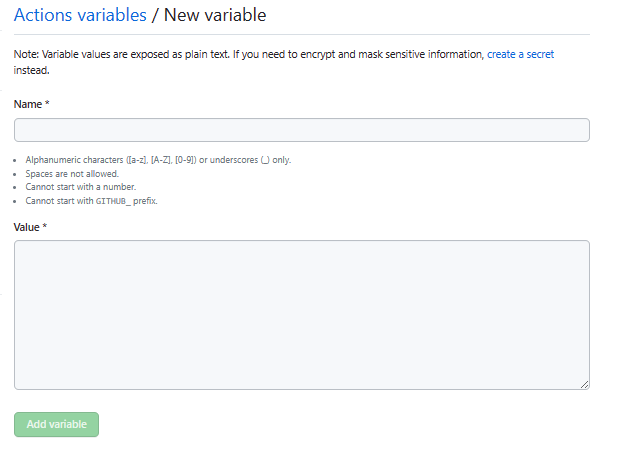

# GitHubActions workflow 一覧

GitHubActions から AWS に接続する際に、利用する workflow ファイルを管理する。

## 概要

- 各プロジェクトで共通して利用される workflow ファイルは汎用テンプレート内で管理する。
- 各 workflow ファイルは、アプリケーションのリポジトリ、またはインフラ(CDK)のリポジトリに配置・実行することを想定した２パターンに分類される。
- 環境毎のブランチで利用する workflow ファイルはプロジェクトに依存するため、各担当者で適宜、取捨選択を行う。

  ※順次更新

  | 名称                           | 配置先リポジトリ | 用途                                                                 |
  | ------------------------------ | ---------------- | -------------------------------------------------------------------- |
  | maintenance-on                 | アプリケーション | Waf に IP 制限とベーシック認証のルールを有効化                       |
  | maintenance-off                | アプリケーション | Waf に IP 制限とベーシック認証のルールを無効化                       |
  | InfraResources_ExecutePipeline | インフラ         | Infra リソースの AllDeploy 対象ファイルの zip 化と S3 配置           |
  | InfraResources_RunTest         | インフラ         | Infra リソースの AllDeploy 対象ファイルへの cdl ls と test.sh の実行 |

- 必要な workflow ファイルが存在しない場合は`workflows_template.yml`から作成する。

## workflows_templates 詳細

### トリガーパターン

- 以下の３パターンを用意しており、要件に応じてコメントイン・削除を実施する。

  1. 手動実行
  1. 自動実行(プルリクエスト作成時)
  1. 自動実行(プッシュ or マージ実行時)

  **workflows_template.yml（on section）**

  ```
  name: <ワークフロー名>

  on:
  # ➀手動実行の場合
  #   workflow_dispatch:
  #     #GitHubActionsの実行時にGUIからユーザに環境変数の入力を求める場合は以下を利用
  #     inputs:
  #       <変数名(ユーザ入力)>:
  #         description: '表示名'
  #         required: true

  # ➁自動実行(プルリクエスト作成時)の場合
  #   pull_request:
  #   branches: main
  #   paths: ['lib/**', 'bin/**', 'params/**'] #トリガー対象ファイル指定箇所

  # ➂自動実行(プッシュ or マージ実行時)の場合
  #   push:
  #     branches: [ "main" ]
  ```

### AWS リソースへの処理実装

- run 以下に実際の AWS リソースに対する操作を AWS CLI 形式 で記載していく。
- AWS CLI コマンド操作をする上で必要な IAM ポリシーをアタッチした IAM ロールを事前に用意しておくこと。詳細は、`doc/HowToUseOIDC.md`を参照

  **workflows_template.yml（run section）**

  ```
  # - name: <動作名>
  #  run: |
  #~以下に動作内容を追記する~
  ```

## GitHubVariables への Role 登録

OIDC にて接続を行う際は必ず下記の手順を実行し、該当のロールを GithubVariables に登録すること。

1.  AWS マネージメントコンソールにアクセスし、デプロイした OIDC スタックから 使用するロールの ARN を取得。
2.  Github にアクセスし、対象リポジトリの「Settings」をクリックし、左ペインにある「Secrets and Variables」→「Actions」をクリックしたら、「New repository variable」をクリック。

    

3.  画面の Name に、使用するワークフローファイルにて「`vars.<Variable 名>_<環境名>`」と記載されている箇所の 「`<Variable 名>_<環境名>`」を入力し、Value に先ほど取得した ARN を貼り付けて Add Variable をクリック。  
    ※`<環境名>`は環境に合わせて yml ファイル側、GithubVariables 側、共に修正・変更必要。
    
